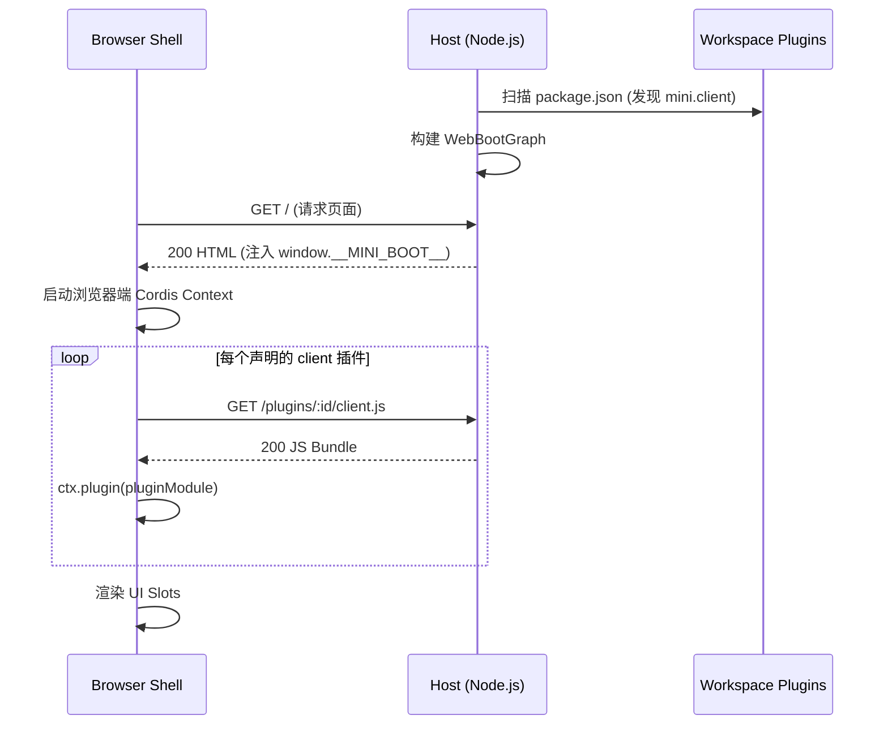

# Agent Note: Host/Client 对称插件与引导架构

Status: implemented

[English](2026-08-18-host-client-symmetric-architecture.md) | 中文

> 范围：描述 mini-dsh 如何在 Host 端（Node.js）与 Client 端（浏览器）分别运行 Cordis 容器，并通过动态清单扫描与 Bundle 分发实现全栈插件协同。

---

## 1. 背景与问题 (Context & Problem)

传统 Web 应用在扩展功能时，前端代码通常在构建期被打包成一个巨大的单体 SPA（如单个 `dist/bundle.js`）。如果新增或卸载一个插件，必须：
1. 修改前端的主入口代码或路由表；
2. 重新执行全量前端打包。

这破坏了“插件化”的核心诉求——**插件的添加与删除应该是自治的，不应要求主应用重新构建或硬编码组件导入**。

---

## 2. 核心架构决策 (Architecture Decision)

### (1) 双端独立的 Cordis 容器 (Dual-End Cordis Instances)
- **Host 端（Node.js）**：以 `apps/cli` 为入口，运行 Node 环境下的 Cordis Context，负责加载系统基础服务与业务后端插件。
- **Client 端（Browser）**：以 `packages/client/shell` 为内核，在浏览器中运行独立的 Cordis Context，负责管理前端模块加载与 UI 插槽组合。

### (2) `mini.client` 清单与动态扫描
- 拥有前端 UI 的插件在其 `package.json` 中声明导出路径：
  ```json
  {
    "name": "@mini-dsh/plugin-greeter",
    "mini": {
      "client": "./dist/client.js"
    }
  }
  ```
- `packages/host/client-modules` 在启动时自动扫描工作区，发现所有带有 `mini.client` 标记的插件，生成动态启动图 `WebBootGraph`：
  ```json
  {
    "modules": [
      { "id": "@mini-dsh/plugin-greeter", "url": "/plugins/@mini-dsh/plugin-greeter/client.js" }
    ]
  }
  ```

### (3) `window.__MINI_BOOT__` 注入与动态加载
- Host 服务在响应 HTML 请求时，将 `WebBootGraph` 作为 `<script>` 注入到 `window.__MINI_BOOT__`。
- 浏览器加载 `client-shell` 后，通过标准的浏览器原生 `import(mod.url)` 动态拉取各插件的 `client.js` Bundle。
- 浏览器端 Cordis 容器调用 `await ctx.plugin(pluginModule)`，自动执行插件前端入口的 `apply(ctx)`。



---

## 3. 架构收益与保证 (Consequences & Guarantees)

1. **前后端能力完全自包含**：一个插件包（如 `@mini-dsh/plugin-greeter`）同时包含后端服务 (`src/index.ts`) 与前端组件 (`src/client.ts`)，真正做到“即插即用”。
2. **主应用零感知（Zero-Touch Core）**：`apps/cli` 和 `packages/client/shell` 不需要关心具体存在哪些业务插件，只需负责分发与装载。
3. **独立的构建产物**：每个前端插件独立构建为 ES Module（`dist/client.js`），主应用无需全量二次打包。
