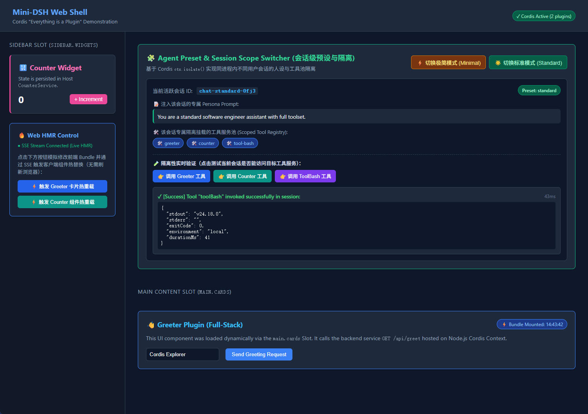

# Mini-DSH: Cordis 极简架构实现与学习指南

本项目是一个极简版（Educational & Minimalist）的 DeepSeek Harness 架构实现，专门用于学习与验证 **Cordis** 框架的核心设计哲学：**“Everything is a plugin”（一切皆插件）**。



> 📖 **推荐必读学习指南**：
> - 🚀 [**《从 CLI 启动到浏览器端动态插件加载全流程》**](docs/beginner-guide.md)：全流程时序图、`window.__MINI_BOOT__` 详解、`client-shell.js` 运作机制与 DSH 源码对标！
> - 🛡️ [**《Capability Seam（能力接缝）与可移植执行世界深入指南》**](docs/capability-seams.md)：Service Definition / Provider / Consumer 三元角色模型与本地/云端沙箱无感切换！
> - 🧩 [**《预设配置体系指南：部署级 Profile vs 会话级 Preset 与 Include & Patch》**](docs/presets-and-profiles.md)：Cordis 作用域隔离（`ctx.isolate`）、多租户会话与全局增量补丁机制！
> - 🔥 [**《Schemastery 配置校验与 HMR 实时热重载指南》**](docs/schemastery-and-hmr.md)：声明式 Schema 校验与文件变更实时热重载！
> - 📝 [**《架构决策记录 (Agent Notes / ADRs)》**](.agents/notes/README.zh.md)：包含所有核心架构决策的中英文演进记录。

---

## 核心设计概念

1. **统一的插件模型（Cordis Plugin）**：
   - 所有的功能、服务、API 路由以及前端 UI 组件全部以 Cordis 插件（`apply(ctx, config)`）形式组织。
   - 通过依赖注入（`ctx.inject(['server', 'slots'])`）实现插件之间的拓扑解耦与延迟挂载。
   - 所有的注册与监听都封装在 `ctx.effect()` 中，支持干净的生命周期管理与销毁（Disposer）。

2. **配置驱动的 Profile 机制**：
   - 通过 YAML 文件（如 `profiles/web.yml`、`profiles/base.yml`）声明启用的插件及其配置参数。
   - 切换 Profile 即切换系统能力，无需修改一行代码。

3. **前后端对称的插件组合架构（Host + Client-Web）**：
   - **Host 端（Node.js）**：
     - 运行 Cordis Context。
     - `host-webserver` 插件提供 `ctx.server` 基础 HTTP 服务。
     - `host-client-modules` 插件自动扫描已加载插件的 `package.json`（带有 `mini.client` 字段），组装 `window.__MINI_BOOT__` 启动图，并分发 `/plugins/:id/client.js`。
   - **Client 端（浏览器 Web GUI）**：
     - 在浏览器中运行 Cordis Context。
     - `client-slots` 插件提供 `ctx.slots` 插槽机制（`main.cards`、`sidebar.widgets`）。
     - `client-shell` 动态 import 插件的前端 Bundle，并在浏览器端的 Cordis 中执行 `apply(ctx)`，将 UI 挂载到对应 Slot。

4. **全栈插件自包含（Full-Stack Plugin）**：
   - 以 `@mini-dsh/plugin-greeter` 和 `@mini-dsh/plugin-counter` 为例：
     - `src/index.ts`：向 Host 提供后端 Service 并挂载 API 路由（如 `/api/greet`、`/api/count`）。
     - `src/client.ts`：向 Client 注册前端交互卡片/控件。
     - 只需要在 `profiles/web.yml` 中添加一行插件名称，前后端能力就会全自动装配上线！

---

## 项目目录结构

```text
mini-dsh/
├── package.json                   # 根目录配置与工作区脚本
├── pnpm-workspace.yaml            # pnpm monorepo 配置
├── tsconfig.base.json             # 基础 TypeScript 配置
├── profiles/                      # 【部署级 Profile】：全局基础设施组装 (Web/Base/Local/Sandbox/Goal/HMR)
│   ├── base.yml                   # Headless 模式（仅基础后端插件与任务运行器）
│   ├── web.yml                    # Web GUI 模式（包含 Web 服务与全栈 UI 插件）
│   ├── local.yml                  # 本地执行世界 Profile（LocalExecutor + ToolBash）
│   ├── sandbox.yml                # 安全沙箱执行世界 Profile（SandboxExecutor + ToolBash）
│   ├── presets.yml                # 多会话隔离演示 Profile（SessionManager + PresetsDemo）
│   ├── goal.yml                   # 增量补丁 Profile（Include base.yml + Patch Insert Goal 领域）
│   └── hmr.yml                    # 实时热重载与 Schemastery 校验 Profile
├── presets/                       # 【会话级 Preset】：用户在每个 Chat 独享的 Agent 预设
│   ├── minimal.yml                # 极简模式：仅分配 ToolBash 与精简 Prompt
│   └── standard.yml               # 标准模式：分配 Greeter + Counter + ToolBash 全套工具
├── apps/
│   └── cli/                       # Host 启动入口 (支持 Include & Patch 动态递归解析与 Schemastery 校验)
└── packages/
    ├── seams/                     # Capability Seams (抽象服务契约层)
    │   └── executor/              # Executor 契约包 (@mini-dsh/seam-executor)
    ├── providers/                 # Service Providers (具体能力提供方)
    │   ├── executor-local/        # 本地进程执行提供方 (@mini-dsh/provider-executor-local)
    │   └── executor-sandbox/      # 远程安全沙箱提供方 (@mini-dsh/provider-executor-sandbox)
    ├── host/
    │   ├── webserver/             # Host HTTP 服务插件 (ctx.server)
    │   ├── client-modules/        # Client 模块扫描与 Bundle 分发 (ctx.clientModules)
    │   ├── session-manager/       # 会话管理与 Preset 子上下文隔离 (ctx.sessions)
    │   └── hmr/                   # 热模块替换与配置监听插件 (@mini-dsh/host-hmr)
    ├── client/
    │   ├── slots/                 # 浏览器 UI 插槽系统 (ctx.slots)
    │   └── shell/                 # 浏览器 Cordis 引导内核 (AppWebEntry)
    └── plugins/
        ├── greeter/               # 问候服务全栈插件 (导出 Schemastery Config Schema)
        ├── counter/               # 计数器全栈插件 (后端状态 + 前端组件)
        ├── tool-bash/             # 面向模型的 Bash 工具插件 (Consumer)
        ├── task-runner/           # Headless 任务运行器插件 (多步骤工作流编排与事件发射)
        ├── presets-demo/          # 多会话作用域隔离演示插件
        ├── goal/                  # 持久化目标状态机领域插件 (@mini-dsh/plugin-goal)
        ├── tool-goal/             # 面向模型的 Goal 工具插件 (@mini-dsh/plugin-tool-goal)
        └── hmr-demo/              # HMR 与 Schemastery 演示插件 (@mini-dsh/plugin-hmr-demo)
```

---

## 快速上手与验证

### 1. 安装依赖与构建 Client Bundle

```bash
# 1. 在 mini-dsh 目录下安装依赖
pnpm install

# 2. 构建所有前端 Client Bundle 与 TypeScript 产物
pnpm run build
```

### 2. 运行 Web GUI 模式

```bash
pnpm start
# 或者指定 profile:
# pnpm --filter @mini-dsh/cli start --profile web
```

在浏览器中打开：**`http://localhost:3000`**

- 你将看到浏览器端 Cordis 容器自动激活。
- `@mini-dsh/plugin-greeter` 自动将问候卡片挂载到 **`main.cards`** 插槽，并在点击时请求 Host 的 `GET /api/greet`。
- `@mini-dsh/plugin-counter` 自动将计数器组件挂载到 **`sidebar.widgets`** 插槽，并在点击时请求 Host 的 `POST /api/count`。
- 提供 `/api/presets` 与 `/api/sessions/create` 接口支持按预设动态创建新会话。

---

### 3. 运行 Headless 模式（对标真实 Agent 运行器）

```bash
# 运行 base profile 下的默认多步骤任务
pnpm start:base

# 或者动态传入自定义任务指令 (模拟 dsh --profile headless "task")
pnpm start:task "Nightly Security Audit and Build"
```

---

### 4. 运行 Include & Patch 全局增量补丁（Goal 领域模式）

完全对标 DeepSeek Harness 的 `examples/headless-agent/goal.cordis.yml`，在无需复制粘贴 100+ 行配置的情况下，通过 `Include + patches.insert` 动态叠加 Goal 状态机：

```bash
pnpm start:goal
```

**控制台输出：**
```text
[Include & Patch] 📦 Including base profile: "./base.yml"
[Include & Patch] ➕ [Insert Patch] Injected 2 plugin(s): @mini-dsh/plugin-goal, @mini-dsh/plugin-tool-goal
[Goal Domain] 🎯 Initialized. Persisted goal state machine active.
[Consumer ToolGoal] 🛠️  Model-facing Goal tool registered (bound to `ctx.goals`).
=======================================================
▶ [TaskRunner] Starting Task: "Deploy Mini-DSH Headless Task"
=======================================================
[Goal Domain] 🎯 Created Goal: "Deploy Mini-DSH Headless Task" (Status: active, Round: 1)
[Step 1/4] Context init: "Hello from Headless Base Profile, Agent Engineer!"
[Goal Domain] 🔄 Goal "Deploy Mini-DSH Headless Task" advanced to Round 2
[Step 2/4] Iteration #1 metric = 110
[Goal Domain] 🔄 Goal "Deploy Mini-DSH Headless Task" advanced to Round 3
[Step 3/4] Iteration #2 metric = 120
[Goal Domain] 🎯 Goal "Deploy Mini-DSH Headless Task" status updated to: completed
```

---

### 5. 运行 Capability Seam 执行世界切换（本地 vs 云端沙箱）

仅通过切换 Profile 配置，即可实现上层工具无感跨环境迁移：

#### 场景 A：在宿主机本地执行（Local Profile）
```bash
pnpm start:local
```
- 控制台输出：`[Local Host Process] 🖥️  Executing: "node -v"`，直接在本地环境中快速执行指令。

#### 场景 B：在云端安全沙箱中执行（Sandbox Profile）
```bash
pnpm start:sandbox
```
- 控制台输出：`[Cloud Sandbox VM: e2b-secure-container-prod] 🔒 Safely isolating`；
- **上层 `tool-bash` 与 `task-runner` 业务代码 0 修改**，命令已自动路由并安全隔离在沙箱容器中执行！

---

### 6. 运行多会话隔离实验（Per-Session Presets 极简 vs 标准模式）

验证在**同一个 Node.js 进程**中，两个不同 Preset 的会话如何通过 Cordis 子上下文（`isolate`）实现能力隔离：

```bash
pnpm start:presets
```

**控制台隔离结果对比：**
* **Session A (`minimal`)**：Prompt 为极简指令，工具池仅拥有 `['tool-bash']`，`ctx.counter` 处于隔离排除状态；
* **Session B (`standard`)**：Prompt 为全功能指令，完整装配 `['greeter', 'counter', 'tool-bash']`。

---

### 7. 运行 Schemastery 声明式校验与 HMR 实时热重载实验

验证在**无需重启 Node.js 进程**的前提下，外部修改配置文件如何被 `HmrService` 实时捕获并驱动插件内部状态瞬间热替换：

```bash
pnpm start:hmr
```

**控制台输出：**
```text
[Cordis Loader] Applying plugin: @mini-dsh/plugin-greeter
[Schemastery] 🛡️ Validated config & injected defaults for "@mini-dsh/plugin-greeter"
[Plugin Greeter] Initialized with prefix: "Initial Greeter" (Enthusiasm: !)
...
[Before HMR] Initial Greeter Output: "Initial Greeter, Bob!"
[Simulated External Editor] 📝 Modifying "scratch-live-config.json" to v2...
[Host HMR] 🔥 Detected change in "scratch-live-config.json"! Triggering live reload...
[After HMR] Hot-Reloaded Greeter Output: "🔥 Hot-Reloaded Super Greeter (v2), Bob!!!!"
✔ [HMR Demo] Live Hot-Reload test completed successfully!
```

---

### 8. 验证 “Everything is a plugin” 的可插拔性

#### 实验 A：在配置文件中禁用一个插件
打开 `profiles/web.yml`，在 `plugin-counter` 节点下增加 `disabled: true`：
```yaml
- name: '@mini-dsh/plugin-counter'
  disabled: true
```
重启服务并刷新浏览器：
- 观察终端日志：`Counter` 插件未加载，未注册 `/api/count` 路由。
- 观察网页：`sidebar.widgets` 插槽中的计数器组件**完全消失**，系统其他功能丝毫不受影响。

#### 实验 B：验证 Headless 优雅降级
打开 `profiles/base.yml`，将 `@mini-dsh/plugin-counter` 设为 `disabled: true`：
```bash
pnpm start:base
```
- 观察 `task-runner`：自动检测到 `counter` 缺失，执行降级逻辑，依然稳定完成工作流！

---

## 许可证 (License)

本项目采用 [MIT 许可证](LICENSE)。

