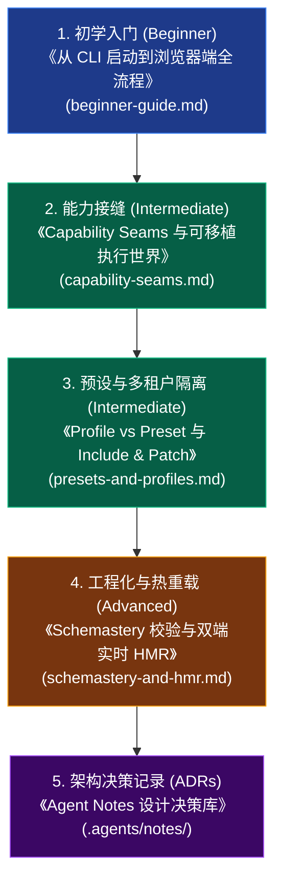

# Mini-DSH 架构与技术文档中心

欢迎查阅 **Mini-DSH** 技术文档中心。本文档体系采用 **渐进式披露（Progressive Disclosure）** 结构编排，帮助开发者从“初学者”逐步进阶到“微内核架构师”。

---

## 📚 推荐学习路线图（Learning Path）

---

## 📑 专题技术指南目录

### 1. [《从 CLI 启动到浏览器端动态插件加载全流程》](beginner-guide.md)
- **适合对象**：第一次接触 Cordis、微内核或 DeepSeek Harness 的开发者。
- **核心内容**：
  - 全流程时序图（CLI $\to$ Host Plugins $\to$ `window.__MINI_BOOT__` $\to$ Browser Shell $\to$ Slot 渲染）；
  - 启动清单数据结构与浏览器握手凭据；
  - UI 插槽装配（`ctx.slots`）与插件自治渲染；
  - 插件停用与前后端同生共死联动机制。

### 2. [《Capability Seam（能力接缝）与可移植执行世界深入指南》](capability-seams.md)
- **适合对象**：需要理解智能体跨环境执行（本地机 vs 云端沙箱）架构解耦的开发者。
- **核心内容**：
  - 架构三元角色模型（Service Definition 契约 / Service Provider 提供方 / Consumer 消费者）；
  - 上层工具零修改：一秒切换本地 Node 子进程与云端 E2B 隔离沙箱；
  - 对标 DeepSeek Harness 官方 `shell`、`bash-local` 与 `e2b` 模块。

### 3. [《预设配置体系指南：部署级 Profile vs 会话级 Preset 与 Include & Patch》](presets-and-profiles.md)
- **适合对象**：需要构建多租户、多会话隔离 Agent 服务的开发者。
- **核心内容**：
  - 部署级 Profile（进程单例底座）与会话级 Preset（会话独享人设与工具池）双层架构；
  - Cordis `ctx.isolate()` 实现单进程内多会话工具严格隔离；
  - `Include & Patch` 递归全局增量补丁（`insert`/`delete`/`update`）算法。

### 4. [《Schemastery 配置校验与 HMR 实时热重载指南》](schemastery-and-hmr.md)
- **适合对象**：需要掌握微内核配置强类型校验与热模块替换机制的开发者。
- **核心内容**：
  - `schemastery` 声明式 `Schema.object` 强类型定义与 Loader 默认值自动注入；
  - Host 端 `chokidar` 产物监听与 `/api/hmr/events` SSE 广播；
  - Browser 端 `client-shell` 动态 `oldFiber.dispose()` 与组件实时热替换；
  - 对标 DeepSeek Harness 官方 `vendor/schemastery` 与 `vendor/hmr`。

---

## 🏛️ 底层架构决策记录 (ADRs)

如需深入了解 Mini-DSH 与 DeepSeek Harness 每一项架构决策的历史背景、被否决的替代方案及演进细节，请查阅：
- 📝 [**架构决策记录索引 (.agents/notes/)**](../.agents/notes/README.zh.md)
