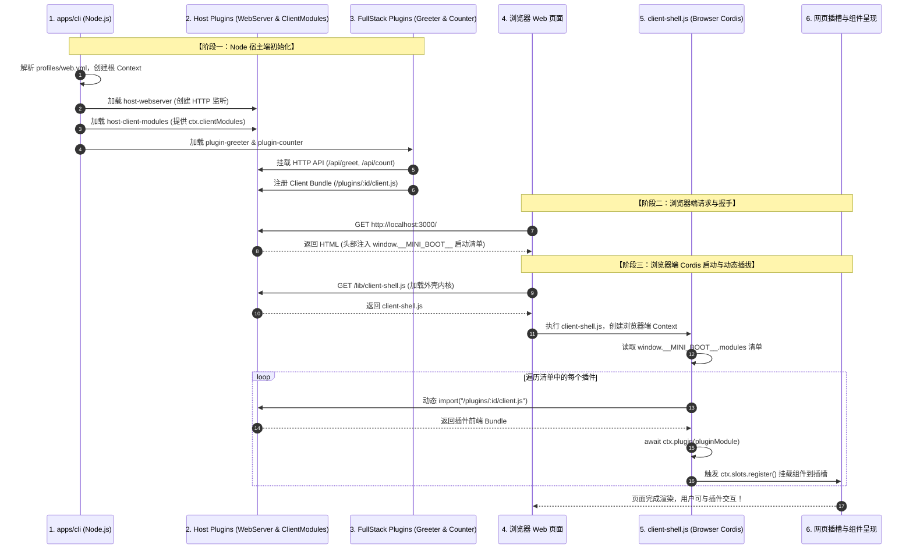

# Mini-DSH 架构学习指南：从 CLI 启动到浏览器端动态插件加载全流程

本文档专为初学者编写，详细拆解 **Mini-DSH** 从命令行输入 `pnpm start` 开始，到浏览器渲染出各个插件 UI 的**完整端到端生命周期**。通过本文档，你可以彻底搞懂 Cordis 插件机制、Host 与 Client 双端通信、启动清单（`window.__MINI_BOOT__`）、UI 插槽系统以及**插件的停用与重启加载**运作原理。

---

## 目录
1. [全流程时序图](#1-全流程时序图)
2. [第一阶段：Host 端启动与插件加载 (Node.js)](#2-第一阶段host-端启动与插件加载-nodejs)
3. [第二阶段：Host 与 Client 的握手凭证（window.__MINI_BOOT__ 启动清单）](#3-第二阶段host-与-client-的握手凭证window__mini_boot__-启动清单)
4. [第三阶段：浏览器端微内核引导 (/lib/client-shell.js)](#4-第三阶段浏览器端微内核引导-libclient-shelljs)
5. [第四阶段：声明式 UI 插槽装配 (packages/client/slots)](#5-第四阶段声明式-ui-插槽装配-packagesclientslots)
6. [第五阶段：插件的停用、重启与生命周期联动机制](#6-第五阶段插件的停用重启与生命周期联动机制)
7. [第六阶段：对标 DeepSeek Harness (dsh) 官方实现](#7-第六阶段对标-deepseek-harness-dsh-官方实现)

---

## 1. 全流程时序图

整个系统从启动到呈现，经过了以下 6 个明确步骤：



---

## 2. 第一阶段：Host 端启动与插件加载 (Node.js)

当你运行 `pnpm start` 时，入口程序是 [**`apps/cli/src/index.ts`**](file:///D:/gh-ws/dsh-ws/mini-dsh/apps/cli/src/index.ts)：

1. **解析 Profile**：读取 `profiles/web.yml`，得到需要启用的插件列表：
   - `@mini-dsh/host-webserver`
   - `@mini-dsh/host-client-modules`
   - `@mini-dsh/plugin-greeter`
   - `@mini-dsh/plugin-counter`
2. **实例化 Cordis 根容器**：
   ```ts
   const ctx = new Context()
   ```
3. **加载插件**：按顺序调用 `await ctx.plugin(mod, config)`。
4. **服务依赖等待（`ctx.inject`）**：
   - `@mini-dsh/host-webserver` 启动并提供 `ctx.server` 服务；
   - `@mini-dsh/plugin-greeter` 通过 `ctx.inject(['server', 'clientModules'])` 检测到 Web 服务和模块服务均已就绪后，执行两个动作：
     - 在后端挂载路由：`ctx.server.route('/api/greet', ...)`；
     - 在前端清单注册自己：`ctx.clientModules.register('@mini-dsh/plugin-greeter', '.../lib/client.js')`。

---

## 3. 第二阶段：Host 与 Client 的握手凭证（`window.__MINI_BOOT__` 启动清单）

### 为什么需要启动清单？
浏览器是一个完全隔离的运行环境，打开网页时它只是一张白纸，根本不知道后端到底启用了哪些插件。
因此，**Host 端在响应网页请求时，把当前启用的所有前端插件 URL 组装成一个 JSON 对象，直接作为全局变量注入到 HTML 头部**。

### 它的数据结构
```json
{
  "modules": [
    {
      "id": "@mini-dsh/plugin-greeter",
      "url": "/plugins/@mini-dsh/plugin-greeter/client.js"
    },
    {
      "id": "@mini-dsh/plugin-counter",
      "url": "/plugins/@mini-dsh/plugin-counter/client.js"
    }
  ]
}
```

### 初学者如何查看这个清单？

#### 方法 A：在浏览器控制台打印（最直观）
打开 `http://localhost:3000`，按 **F12** 打开控制台，输入：
```js
window.__MINI_BOOT__
```
按下回车，即可查看当前页面加载的所有插件清单。

#### 方法 B：查看网页源代码
在网页空白处右键点击 **“查看网页源代码”**（`Ctrl + U`），可以在 `<head>` 区域看到注入的 `<script>` 标签：
```html
<script>
  window.__MINI_BOOT__ = {"modules":[{"id":"@mini-dsh/plugin-greeter","url":"/plugins/@mini-dsh/plugin-greeter/client.js"},{"id":"@mini-dsh/plugin-counter","url":"/plugins/@mini-dsh/plugin-counter/client.js"}]};
</script>
```

#### 方法 C：通过命令行 API 查询
```bash
curl http://localhost:3000/api/plugins
```

---

## 4. 第三阶段：浏览器端微内核引导 (`/lib/client-shell.js`)

在 HTML 底部，通过如下标签引入了外壳内核：
```html
<script type="module" src="/lib/client-shell.js"></script>
```

### 什么是 `client-shell.js`？
它是浏览器端的**引导操作系统**（源码在 [**`packages/client/shell/src/index.ts`**](file:///D:/gh-ws/dsh-ws/mini-dsh/packages/client/shell/src/index.ts)）。它**不包含任何具体的业务 UI**（它不知道什么是问候卡片、什么是计数器），它的唯一职责是：

1. **在浏览器中创建独立的 Cordis 容器**：
   ```ts
   const ctx = new Context()
   ```
2. **挂载基础插槽服务**：
   ```ts
   await ctx.plugin(SlotsPlugin) // 提供 ctx.slots
   ```
3. **根据清单动态拉取插件**：
   ```ts
   for (const mod of window.__MINI_BOOT__.modules) {
     // 触发浏览器原生网络请求: GET /plugins/@mini-dsh/plugin-greeter/client.js
     const pluginModule = await import(mod.url)
     // 将插件装载到浏览器端 Cordis 容器中
     await ctx.plugin(pluginModule)
   }
   ```
4. **渲染页面插槽**：调用 `ctx.slots.renderSlot('main.cards', container)` 等。

---

## 5. 第四阶段：声明式 UI 插槽装配 (`packages/client/slots`)

### 什么是插槽（Slot）？
传统的 Web 页面往往由主应用写死所有的 HTML 结构；而微内核插件架构中，**主页面只定义插槽区域（Placeholder），具体由哪些插件来填充内容，完全由插件自治决定**。

在 Mini-DSH 中，我们在 HTML 中预留了插槽锚点：
- `#slot-main-cards`：主内容卡片插槽（`main.cards`）
- `#slot-sidebar-widgets`：侧边栏小组件插槽（`sidebar.widgets`）

### 插件是如何挂载进插槽的？
当浏览器动态 `import()` 加载 `@mini-dsh/plugin-greeter/client.js` 时，该插件前端的 `apply(ctx)` 被执行：
```ts
// packages/plugins/greeter/src/client.ts
export function apply(ctx: Context) {
  ctx.inject(['slots'], (ctx) => {
    ctx.effect(() => {
      // 向 main.cards 插槽注册问候卡片
      return ctx.slots.register('main.cards', (container) => {
        container.innerHTML = `<div class="card"><h3>👋 Greeter Plugin</h3>...</div>`
        // 绑定按钮点击事件，发起 fetch('/api/greet') 请求...
      })
    })
  })
}
```
此时，`client-shell` 监听到 `slot/updated` 事件，自动将该卡片渲染到页面的主内容区域！

---

## 6. 第五阶段：插件的停用、重启与生命周期联动机制

在微内核架构中，**插件的停用（Deactivation）与重新加载（Reloading）是最能体现架构优雅度的地方**。

### 1. 如何停用一个插件？
停用插件完全通过 Profile 配置文件驱动，无需改动任何代码。通常有两种方式：

- **方式 A（推荐）：在 YAML 中设置 `disabled: true`**
  打开 `profiles/web.yml`，给目标插件增加标记：
  ```yaml
  - name: '@mini-dsh/plugin-counter'
    disabled: true    # <--- 设置为停用
    config:
      initialCount: 0
  ```
- **方式 B：直接从 YAML 列表中删除或注释该行**。

---

### 2. 停用后的底层联动原理（前后端同生共死）

为什么在 Profile 中停用后，前后端能力会**同时、干净地消失**？

```text
[修改 profiles/web.yml: disabled: true]
               │
               ▼ (重启应用 pnpm start)
┌─────────────────────────────────────────────────────────────┐
│ 1. Host 启动器 (apps/cli)                                   │
│    检测到 disabled: true，跳过该插件的 apply(ctx) 执行       │
└──────────────┬──────────────────────────────┬───────────────┘
               │                              │
        (未注册 API 路由)              (未向 clientModules 登记)
               ▼                              ▼
┌──────────────────────────────┐ ┌────────────────────────────┐
│ 2. WebServer 路由表          │ │ 3. window.__MINI_BOOT__    │
│    /api/count 不存在 (404)   │ │    清单中完全剔除 counter  │
└──────────────────────────────┘ └─────────────┬──────────────┘
                                               │
                                       (浏览器只请求有效插件)
                                               ▼
                                 ┌────────────────────────────┐
                                 │ 4. 浏览器 Web Shell        │
                                 │    根本不拉取 counter JS   │
                                 │    插槽完全清空，零报错    │
                                 └────────────────────────────┘
```

1. **Host 侧**：`apps/cli` 扫描到 `disabled: true`，跳过加载。因此：
   - 后端路由 `/api/count` **根本不会被注册**（外部请求直接 404）；
   - `ctx.clientModules.register` **根本不会被调用**。
2. **清单侧**：由于 `clientModules` 中没有该插件的记录，生成的 `window.__MINI_BOOT__` 清单里只有 `plugin-greeter`。
3. **Client 侧**：浏览器打开网页时，只根据清单拉取 `plugin-greeter/client.js`，**压根不会下载 `plugin-counter` 的前端文件**。
4. **UI 侧**：`sidebar.widgets` 插槽因为没有插件注册，显示默认占位符，**没有任何孤儿请求，没有任何报错**！

---

### 3. 操作指引：停用与重新启用

#### 步骤一：停用实验
1. 修改 `profiles/web.yml`，将 `@mini-dsh/plugin-counter` 设为 `disabled: true`；
2. 回到运行终端，按快捷键 `Ctrl + C` 退出；
3. 执行 `pnpm start` 重启；
4. 刷新浏览器 `http://localhost:3000`，确认侧边栏计数器组件彻底消失。

#### 步骤二：重新启用实验
1. 修改 `profiles/web.yml`，将 `disabled: true` 删掉（或改为 `disabled: false`）；
2. 终端按 `Ctrl + C` 退出并执行 `pnpm start` 重启；
3. 刷新浏览器，计数器组件与 `/api/count` 后端服务瞬间完整复活！

---

### 4. 进阶思考：静态重启 vs 动态热重载 (HMR)

| 模式 | 机制 | 适用场景 |
|---|---|---|
| **配置静态重启 (Mini-DSH)** | 修改 YAML 配置文件后，重启 CLI 进程，重新走完整的 Boot 链路。 | 生产部署、模式切换、能力裁剪。 |
| **运行时动态注销 (Cordis Disposer)** | 在运行时通过代码调用 `ctx.fiber.dispose()`，Cordis 会自底向上执行所有 `ctx.effect()` 返回的清理函数，实时卸载路由和组件，**无需重启进程**。 | 动态插件市场、在线热插拔。 |
| **开发期热重载 (DSH HMR)** | `deepseek-harness` 完整版中包含 `packages/client/hmr`，通过 Server-Sent Events (SSE) 监听 Bundle 变动并实时重载浏览器端插件 Fiber，**页面无需手动刷新**。 | 高效开发体验。 |

---

## 7. 第六阶段：对标 DeepSeek Harness (`dsh`) 官方实现

Mini-DSH 严格复刻了 DeepSeek Harness 官方的架构模式。下表为两者的概念与源码映射：

| 架构概念 | Mini-DSH 极简实现 | DeepSeek Harness 官方模块 | 说明 |
|---|---|---|---|
| **Host 启动器** | `apps/cli/src/index.ts` | [`apps/cli`](file:///d:/gh-ws/dsh-ws/deepseek-harness/apps/cli/README.md) + [`packages/boot/app-boot`](file:///d:/gh-ws/dsh-ws/deepseek-harness/packages/boot/app-boot/README.md) | 解析 Profile 并驱动 Cordis 启动 |
| **启动清单** | `window.__MINI_BOOT__` | `window.__DSH_BOOT__` (`WebBootGraph`) | Host 注入 HTML 的前端依赖清单 |
| **模块分发服务** | `packages/host/client-modules` | [`packages/client/modules`](file:///d:/gh-ws/dsh-ws/deepseek-harness/packages/client/modules/README.md) (Node 半) | 扫描活动插件并在 `/plugins/:id/client.js` 供给 Bundle |
| **浏览器引导内核** | `packages/client/shell` | [`packages/client/web`](file:///d:/gh-ws/dsh-ws/deepseek-harness/packages/client/web/README.md) (`AppWebEntry`) | 浏览器端初始化 Cordis 容器并动态 import 插件 |
| **UI 插槽底座** | `packages/client/slots` | [`packages/client/ui-slots`](file:///d:/gh-ws/dsh-ws/deepseek-harness/packages/client/ui-slots/README.md) (`ctx.slots`) | 提供通用的 `register(slotName, Component)` 插槽解耦机制 |
| **全栈插件结构** | `packages/plugins/*` (`src/index.ts` + `src/client.ts`) | `packages/*` (`packages/goal/goal-local` + `packages/client/ui-goal`) | 自包含前后端逻辑，通过 Profile 配置实现插拔 |
| **Headless 任务运行器** | `packages/plugins/task-runner` | [`packages/core/agent-loop`](file:///d:/gh-ws/dsh-ws/deepseek-harness/packages/core/agent-loop/README.md) + [`packages/bundle/headless`](file:///d:/gh-ws/dsh-ws/deepseek-harness/packages/bundle/headless/README.md) | 多步骤工作流调度、服务依赖装配、事件发射与收尾 |
| **能力接缝 (Capability Seam)** | `packages/seams/executor` + `providers/*` + `tool-bash` | [`packages/shell/shell`](file:///d:/gh-ws/dsh-ws/deepseek-harness/packages/shell/shell/README.md) + `bash-local` + `tool-bash` | 契约、提供方、消费者三元解耦，详见 [Capability Seams 指南](capability-seams.md) |
| **会话级预设 (Presets)** | `presets/*.yml` + `@mini-dsh/host-session-manager` | [`apps/cli/config/agent-presets/`](file:///d:/gh-ws/dsh-ws/deepseek-harness/apps/cli/config/agent-presets) + `packages/preset/agent-presets` | 多租户会话隔离与动态人设/工具装配，详见 [Presets 与 Profiles 指南](presets-and-profiles.md) |
| **增量补丁 (Include & Patch)** | `@mini-dsh/plugin-include` + `profiles/goal.yml` | [`vendor/include`](file:///d:/gh-ws/dsh-ws/deepseek-harness/vendor/include/README.md) + `goal.cordis.yml` | 声明式全局配置复用与补丁插入 |

---

## 8. 扩展技术指南

- 📖 [Capability Seams（能力接缝）与可移植执行世界深入指南](capability-seams.md)
- 📖 [预设配置体系指南：部署级 Profile vs 会话级 Preset 与 Include & Patch](presets-and-profiles.md)

